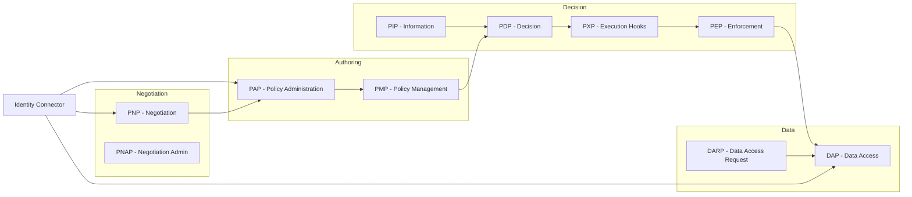

# Rights Management Architecture

This document defines the architecture of the TWIN Foundation Rights Management subsystem. It specifies the responsibility boundaries of core components, the policy and negotiation lifecycle, extensibility contracts, and interaction flows (including integration with IDS Contract Negotiation and ODRL policy semantics). The intent is to precise describe the runtime model so that new extensions can be implemented without ambiguity.

A majority of the modules form part of the specification [International Data Spaces Architecture Model - Policy Enforcement](https://docs.internationaldataspaces.org/ids-knowledgebase/ids-ram-4/layers-of-the-reference-architecture-model/3-layers-of-the-reference-architecture-model/3_4_process_layer/3_4_6_policy_enforcement)

Core domain concepts:

- [Policy](#policy)
- [Policy Locator](#policy-locator)
- [Offer](#offer)
- [Agreement](#agreement)
- [Node](#node)

Implemented architectural components:

- [Policy Administration Point (PAP)](#policy-administration-point-pap)
- [Policy Management Point (PMP)](#policy-management-point-pmp)
- [Policy Information Point (PIP)](#policy-information-point-pip)
- [Policy Execution Point (PXP)](#policy-execution-point-pxp)
- [Policy Decision Point (PDP)](#policy-decision-point-pdp)
- [Policy Enforcement Point (PEP)](#policy-enforcement-point-pep)
- [Policy Negotiation Point (PNP)](#policy-negotiation-point-pnp)
- [Policy Negotiation Admin Point (PNAP)](#policy-negotiation-admin-point-pnap)
- [Data Access Point (DAP)](#data-access-point-dap)
- [Data Access Request Point (DARP)](#data-access-request-point-darp)

## Component Overview Diagram



## Concepts

### Policy

Policies are encoded using the [ODRL information model](https://www.w3.org/TR/odrl-model/). A Policy instance may be an Offer (provider-side promise) or an Agreement (mutual contract). Policies are treated as immutable once persisted except via explicit administrative update operations in the PAP (e.g. revocation, supersession). Integrity, provenance, and version traceability are expected but outside the immediate scope of this document.

### Policy Locator

A Policy Locator is a structured selector used to reduce the candidate policy search space for execution or negotiation. It MUST contain sufficient discriminators such that the set returned by the PMP is computationally tractable.

Typical discriminator fields:

| Field       | Meaning                                                                 |
| ----------- | ----------------------------------------------------------------------- |
| `assetType` | Logical asset class or domain aggregate identifier.                     |
| `action`    | Requested operation (e.g. `read`, `write`, `invoke`).                   |
| `assignee`  | (Optional) Target principal (consumer identity) relevant to Agreements. |

Wildcard semantics: a wildcard for a field does NOT match all stored values; it only matches policies for which that field value is absent / `undefined`. This enables inheritance‑style fallbacks while avoiding uncontrolled broad scans.

### Offer

An Offer is a Policy containing a mandatory `assigner` (provider identity) and no mandatory `assignee`. It represents a unilateral capability that MAY be negotiated into an Agreement. Offer invariants: (1) assigner MUST be resolvable to a DID or equivalent verified identity; (2) constraints/duties MAY be present; (3) obligations MUST be satisfiable by the prospective consumer.

### Agreement

An Agreement is a Policy containing both mandatory `assigner` and `assignee`. It is the authoritative contract artifact produced by negotiation or administrative issuance. Agreements MAY embed constraints, duties (obligations), and prohibitions consistent with ODRL. Post‑finalisation mutation SHOULD be limited to status transitions (e.g. revocation) recorded with audit metadata.

### Node

A Node is an independently deployable TWIN runtime instance that can both publish Offers and acquire Agreements for remote data assets. Each Node exposes a DID document containing a verification method named (by convention) `node-authentication-assertion` used for cross-node authorization tokens.

## Authorization

Cross-node invocations are authenticated using a detached trust mechanism rather than local user credentials. Each rights management HTTP interface requires an `Authorization` header of the form:

```text
Authorization: Bearer <jwt>
```

The JWT MUST be signed with the private key corresponding to the caller Node's DID verification method `node-authentication-assertion`.

Verification steps:

1. Resolve caller DID document.
2. Extract `node-authentication-assertion` public key material.
3. Verify signature and standard claims (iat/exp/nbf) plus domain-specific claims (e.g. requesting node id, audience).
4. Reject if expired, malformed, unsupported algorithm, or key mismatch.

## Policy Administration Point (PAP)

The PAP provides authoritative persistence for Policy entities.

Capabilities:

- Create / update / soft delete (revocation) / read by identifier.
- Query by indexed fields aligned with Policy Locator discriminators.
- Enforce structural validation against the ODRL model subset adopted by the platform.

The PAP MUST NOT implement evaluation semantics; it is intentionally passive.

## Policy Management Point (PMP)

The PMP resolves candidate Policies relevant to an access evaluation or negotiation request.

Responsibilities:

- Translate a Policy Locator into one or more PAP queries (including wildcard = missing field logic).
- Apply in-memory filtering for secondary criteria not indexed in storage.
- Return an ordered set (deterministic, typically by specificity then recency) to the PDP or PNP.

The PMP MUST avoid returning duplicate logical policies (e.g. multiple versions) unless explicitly requested.

## Policy Information Point (PIP)

The PIP supplies contextual facts (JSON-LD documents) to evaluators and negotiators. Extensibility is achieved via registered `Information Sources`.

Invocation model:

- PDP request: ALL sources invoked (parallel where possible); both private and public facts returned.
- PNP negotiation: ONLY public facts exposed to counterparties; private facts retained for local decision support.

Sources SHOULD be side-effect free and SHOULD implement internal caching for expensive lookups.

## Policy Execution Point (PXP)

The PXP provides ordered pre-/post-evaluation interception around PDP decision computation. Extension units are `Execution Actions`.

Lifecycle:

1. `before` phase: actions receive locator, candidate policies, and preliminary context (no decisions yet). They MAY enrich context or short-circuit (e.g. deny all) subject to platform policy.
2. `after` phase: actions receive immutable decision set; they MAY emit telemetry, obligations scheduling requests, or enforcement hints.

Actions MUST be idempotent and SHOULD be resilient to partial failure (one failing action must not corrupt the evaluation pipeline unless configured as critical).

## Policy Decision Point (PDP)

The PDP produces an authoritative authorization decision set (permits / denials / obligations) for a given Policy Locator and input data context. It composes PMP, PIP, PXP, and registered `Arbiters`.

Evaluation pipeline:

1. Resolve candidate policies via PMP.
2. Invoke PXP `before` actions.
3. Aggregate contextual facts via PIP.
4. Invoke each Arbiter with (policies, context facts, request data). Arbiters return zero or more atomic decisions.
5. Normalize and merge decisions (deduplicate, resolve conflicts via Arbiter-defined precedence or platform defaults).
6. Invoke PXP `after` actions.
7. Return final decision set to caller (PEP or other consumer).

Error handling: If zero Arbiters are registered an error (e.g. `noSupportedArbiters`) MUST be raised. Individual Arbiter failures SHOULD be isolated; a catastrophic failure aborts with `decidingFailed` (exact codes defined elsewhere).

Arbiters SHOULD be deterministic for identical inputs and MUST NOT mutate shared policy objects.

## Policy Enforcement Point (PEP)

The PEP applies PDP decisions to a candidate data set.

Process:

1. Submit locator + data to PDP.
2. Receive decision set (permits, denies, obligations, transformations hints).
3. Execute registered `Enforcement Processors` sequentially, each producing the next data version.
4. Return the final (potentially redacted or transformed) data or raise an enforcement exception.

Ordering is deterministic by registration sequence.

### Applying Enforcement

Any in-process component can invoke policy enforcement directly by resolving the PEP component and calling `intercept()`.

This provides:

1. Inline authorization (permit / deny) for a single piece of JSON-LD data or collection.
2. Declarative transformation (redaction, augmentation, obligation-driven adjustments) applied consistently with the rest of the platform.

Illustrative usage:

```ts
// No input data, just trying to see if data is accessible
// the return type is determined by the PEP
const response = await pep.intercept({
  locator: { assetType: 'aig:AuditableItemGraphVertex', action: 'use' }
});

const isAllowed = Coerce.boolean(response);
console.log('Access is allowed', isAllowed);
```

```ts
// JSON-LD document from regular data processing is handed
// to the PEP to transform the data
const processedAigDocument = await pep.intercept({
  locator: { assetType: 'aig:AuditableItemGraphVertex', action: 'read' },
  data: aigDocument
});
```

Embedding the PEP directly inside component‑specific REST endpoints constrains cross‑node interoperability: authorization remains bound to the nodes internal credential domain, preventing external nodes from invoking those endpoints via standardized rights‑management tokens.

For broader external exposure of a component's data without modifying its internal implementation, prefer the [DAP](#data-access-point-dap) which provides a method for registering a handler for a services asset classes.

## Policy Negotiation Point (PNP)

The PNP implements the [IDS Contract Negotiation](https://docs.internationaldataspaces.org/ids-knowledgebase/dataspace-protocol/contract-negotiation/contract.negotiation.protocol) state machine, producing Agreements from Offers through bilateral interaction.

Capabilities:

- Register Offers for one or more asset classes / data types.
- Initiate or accept negotiations; persist state transitions atomically.
- Select a `Negotiator` (producer side) by probing for support; reuse selected negotiator for the negotiation lifespan.
- Dispatch negotiation progress events to a `Requester` (consumer side callback handler).
- Finalize: on `FINALIZED`, persist Agreement into PAP.
- Termination handling with explicit reason codes.

Extensibility:

- Negotiators implement Offer evaluation, counter-offer generation, and potential obligation insertion.
- Requesters receive lifecycle callbacks: offer, agreement, finalised, terminated (names normative).

### Manual Intervention

A Negotiator MAY request a pause requiring administrative action. Such negotiations enter a managed state handled through PNAP operations before resumption.

## Policy Negotiation Admin Point (PNAP)

PNAP exposes administrative CRUD + query over negotiation instances.

Functions:

- Query stalled / intervention-required negotiations.
- Apply administrative decisions (approve, reject, inject amended terms).
- Resume or terminate negotiations with auditable rationale.

## Data Access Point (DAP)

DAP mediates data asset CRUD + query operations and integrates PEP enforcement.

Responsibilities:

- Register asset-type specific `Handlers` implementing canonical CRUD + query contract.
- Authorize inbound operations by invoking PEP (which cascades to PDP) prior to handler execution (except where explicitly marked public).
- Propagate enforcement-modified data (e.g. redactions) back to the caller.

e.g. Auditable Item Graph (AIG)

The AIG registers an asset-type specific `Handler` via the DAP to expose its data through the unified rights-management enforcement pipeline.

Benefits:

1. External (cross-node) consumers cannot rely on the AIG's internal/auth-local routes; instead they traverse a path protected by standardized authorization + PDP/PEP evaluation.
2. Enforcement (permit/deny, redaction, obligation-triggered transformations) is applied centrally by the DAP/PEP chain without invasive modifications to existing AIG domain logic.

Illustrative registration:

```ts
dap.registerHandler({
  supportedAssetTypes(): ["aig:AuditableItemGraphVertex"],
  async create(assetType: string, item: IJsonLdNodeObject): Promise<string>,
  async read(assetType: string, id: string): Promise<IJsonLdNodeObject>,
  async update(assetType: string, item: IJsonLdNodeObject): Promise<void>),
  async remove(assetType: string, id: string),
  async query(assetType: string, conditions, cursor?: string, options?: unknown): Promise<{items: IJsonLdNodeObject[], cursor?: string}>
});
```

The query method has an `options` parameter which can be handler specific, for example the AIG can accept include `id` and `idMode` in a query.

## DAP Runtime Enforcement

At runtime the DAP invokes enforcement at the following points:

| Operation | ODRL Pre Action | ODRL Post Action | Enforcement Effect                                                              |
| --------- | --------------- | ---------------- | ------------------------------------------------------------------------------- |
| Create    | `write`         | -                | Policy may transform or validate input prior to persistence.                    |
| Read      | `use`           | `read`           | Authorization; response may be filtered, redacted or augmented.                 |
| Update    | `modify`        | -                | Policy may constrain or transform the updated content.                          |
| Remove    | `delete`        | -                | Authorization check permits deletion.                                           |
| Query     | `use`           | `read`           | Authorization; per-item filtering/redaction/augmentation applied to result set. |

## Data Access Request Point (DARP)

DARP acts as an outbound client for remote DAP endpoints. Given the target Node URL and desired `assetType` (plus operation parameters), it:

1. Constructs and signs the required authorization token (see Authorization section).
2. Performs any required negotiation bootstrap if no valid Agreement exists (future enhancement if not yet implemented).
3. Issues the HTTP request with appropriate headers.
4. Validates response (status, signature/attestation if provided) and returns data to caller.

Error handling includes classification of network, authorization, negotiation, and remote enforcement failures.

## Extensibility Patterns

| Extension             | Interface                     | Register Via               | Notes                                                                                 |
| --------------------- | ----------------------------- | -------------------------- | ------------------------------------------------------------------------------------- |
| Arbiter               | `IPolicyArbiter`              | `registerArbiter` (PDP)    | Multiple arbiters aggregated; conflict resolution strategy documented per deployment. |
| Negotiator            | `IPolicyNegotiator`           | `registerNegotiator` (PNP) | First supporting negotiator selected (ordered probing).                               |
| Requester             | `IPolicyRequester`            | `registerRequester` (PNP)  | Receives lifecycle callbacks (offer, agreement, finalised, terminated).               |
| Data Handler          | `IDataAccessHandler`          | `registerHandler` (DAP)    | Asset-type specific CRUD + query.                                                     |
| Information Source    | `IPolicyInformationSource`    | `registerSource` (PIP)     | Provides contextual facts (public/private partition).                                 |
| Enforcement Processor | `IPolicyEnforcementProcessor` | `registerProcessor` (PEP)  | Sequential data transformation; ordering deterministic.                               |
| Execution Action      | `IPolicyExecutionAction`      | `registerAction` (PXP)     | Pre-/post-evaluation interception.                                                    |

All extension points MUST be able to be safely unregistered (idempotent) and SHOULD validate uniqueness where duplicate registration would cause ambiguity.
